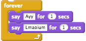
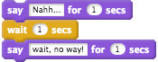
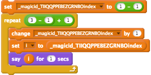

# Experimental Text-based Scratch

It turns code into [scratchblocks](https://github.com/tjvr/scratchblocks/)!

## Using this

First you'll want to open up the site for this: http://liam4.github.io/experimental-text-scratch/experiment.html

Here are the future-deprecated steps:

1. Open up your web developer console.
2. Type out some code. Probably in the form of ```code = `/* code */` ```.
3. Grab a tree. `tree = parse(code)`
4. Make the code into scratchblocks code. `sb = blockify(tree)`
5. Copy the scratchblocks code.

Now that you have that code, feel free to cry at markdown (or just my editor?) for not supporting starting lists at non-1 indexes.

6. Paste the scratchblocks code into the [official scratchblocks site](http://scratchblocks.github.io/) and maybe see if it makes sense to you.
7. You'd better have a [Scratch](https://scratch.mit.edu/) account.
8. Go to the [official scratchblocks testing topic](https://scratch.mit.edu/discuss/topic/14778/).
9. Paste in the scratchblocks code surrounded like this: `[scratchblocks] /* code! */ [/scratchblocks]`
10. Submit your post.
11. Find your post, then click on the fancy "add to backpack" button that was recently added.
12. Go through whatever steps there are to add the script to your backpack. I couldn't tell you how much that'll have changed since writing this.
13. [Open](scratch.mit.edu/projects/editor) a scratch project.
14. Inside your backpack ([at the very end?](https://github.com/tjvr/scratchblocks/issues/161)) drag out the script that was just added, into the scripts area.
15. Click on the script.
16. ???
17. Profit!

## Okay, but what about the syntax?

[Here you go!](js/grammar.ne) Nah, I'm not that mean.

A program is a set of lines, each representing one stack block in Scratch. A line follows the form of:

	blockname arg1, arg2, arg3...

Each argument is an expression, which can be a string:

	'kaz'

..a number:

	110026

..a script:

	{
	  kaz
	}

..or a variable:

	$name
	$(this name has spaces in it)

## What commands?

Everything that's part of the `blockifyDictionary` definition in [js/main.js](js/main.js).

<table width="100%"><tr>
<th>	Code
<th>	Example Code
<th>	Resulting Scratch Script
</tr><tr>
<td>	<code>say string</code>
<td>	<pre>say 'Where did "kaz" come from?'</pre>
<td>	<a href="img/readme/say.png"></a>
</tr><tr>
<td>	<code>says string, number</code>
<td>	<pre>says 'Hello, world!', 2</pre>
<td>	<a href="img/readme/says.png"></a>
</tr><tr>
<td>	<code>forever stack</code>
<td>	<pre>forever {<br>  says 'Ayy', 1<br>  says 'Lmaoium', 1<br>}</pre>
<td>	<a href="img/readme/forever.png"></a>
</tr><tr>
<td>	<code>waits number</code>
<td>	<pre>says 'Nahh...', 1<br>waits 1<br>says 'wait, no way!', 1</pre>
<td>	<a href="img/readme/waits.png"></a>
</tr><tr>
<td>	<code>add(number, number)</code>
<td>	<pre>say add(1, 2)</pre>
<td>	<a href="img/readme/add.png"></a>
</tr><tr>
<td>	<code>sub(number, number)</code>
<td>	<pre>say sub(7, 3)</pre>
<td>	<a href="img/readme/sub.png"></a>
</tr><tr>
<td>	<code>join(string, string)</code>
<td>	<pre>say join('Hello ', 'world')</pre>
<td>	<a href="img/readme/join.png"></a>
</tr><tr>
<td>	<code>joinmul(string, ...string)</code>
<td>	<pre>say joinmul('Hello ', ' less nested', ' blocks!'</pre>
<td>	<a href="img/readme/joinmul.png"></a>
</tr><tr>
<td>	<code>forrange string, number, number, stack</code>
<td>	<pre>forrange 'i', 1, 3, {<br>  says $i, 1<br>}</pre>
<td>	<a href="img/readme/forrange.png"></a>
</tr><tr>
<td>	<code>var(string literal)</code>
<td>	<pre>say var('(parentheses)')</pre>
<td>	<a href="img/readme/var.png"></a>
</tr></table>
